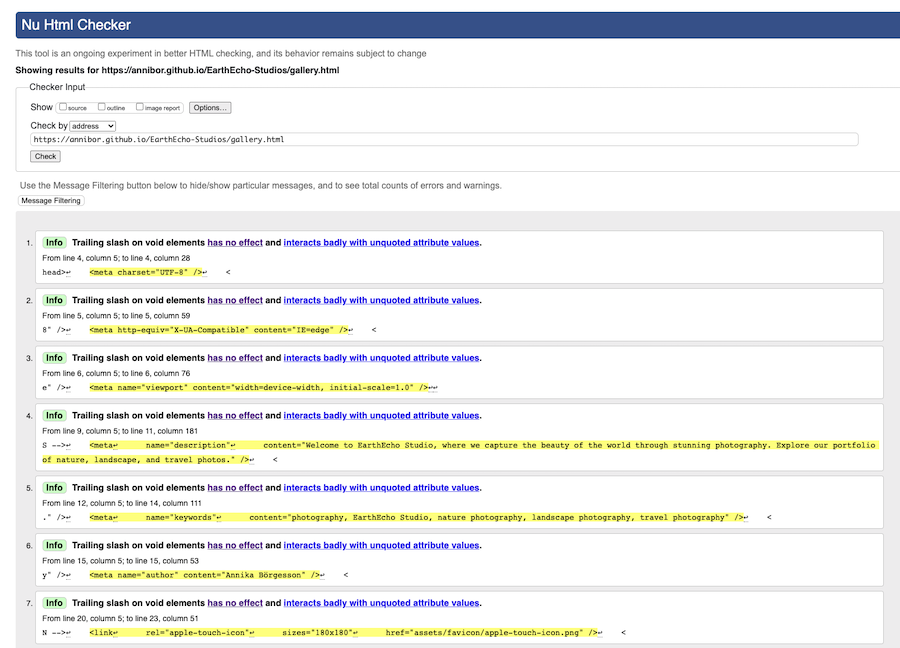

# EarthEcho Studios

# Introduction

Welcome to EarthEcho Studios! I'm thrilled to have you here and share a glimpse of Sophies world of visual storytelling through photography. Sophie is an amazing photographer specializing in weddings, portraits, product photograpy. This webpage is for anyone that want to catch a special moment or wanting tp get high-quality photos of their own products and stores.
This is a fictional company and a made up character for this educational project.
This README serves as your guide to navigate through the building of this website.

## Table of Content

- [**EarthEcho Studios**](#EarthEcho-Studios)
  - [**Table of Content**](#table-of-content)
  - [**Planning & development**](#planning--developmnet)
    - [**Project Goals**](#project-goals)
    - [**User-Centered Approach**](#user-centered-approach)
      - [**As a buisness Owner**](#as-a-buisness-owner)
      - [**As a General user/costumer**](#as-a-general-usercostumer)
      - [**As a New User**](#as-a-new-user)
    - [**Wireframes**](#wireframes)
      - [**Home Page**](#home-page)
      - [**Gallery Page**](#gallery-page)
      - [**Product Page**](#product-page)
      - [**Contact Page**](#contact-page)
    - [**Colors**](#colors) -[**Design Philosophy/ Features**](#design-philosophy-features)
  - [**Testing**](#testing) -[**Devtools**](#devtools)
    - [**Ligthouse**](#lighthouse)
      - [**Issues**](#issues)
      - [**Results**](#results)
  - [**Deployment**](#deployment)
  - [**Languages**](#languages)
  - [**Software**](#software)
  - [**Media**](#media)
  - [**Credits**](#credits)
  - [**Special thanks**](#special-thanks)

## Planning & developmnet

<!-- Needs edit-->

In the process of creating EarthEcho Studios, I followed a plan that revolved around Sophie's vision for her photography business. The development of the website had the following goals to aim for:

### Project Goals

1. **Online Presence**: To establish an online presence for Sophie's business EarthEcho Studio. This to reach a larger audince and a way for Sophie to show her work to the world.

2. **Costumer Base**: Making it easier for potential clients to find ans connect with Sophie and therfore growing her local costumer base.

3. **Booking Platform**: Making a way for costumers to cotact and book a photoshoot with Sophie, based on thir own preferenses.

4. **Costumer Interaction**: Offer a clear and accessible contact information for the costumers.

5. **Information Accessibility**: Make sure both new as well as existing costumers easily can access relevant informatino about EarthEcho Studios and the services Sophie have.

### User-Centered Approach

#### As a buisness Owner

Sophie, as the owner of EarthEcho Studios ans the website, she had the following objectives:

- To create an online presence to be able to promote her photography and her business.
- Expand the costumer base by showcasing her work online.
- Being able to provide a clear easly fond contact option for costumers for booking or asking questions.
- Have correct and easily understandable information for her costumers as well as for potential costumers.

#### As a General user/costumer

Users and potential costumers visiting EarthEcho Studios wanted to:

- Get to know the photographer Sophie, to be able to figure out if she's the right fit for them.
- Find contact information and being able to get in contact with Sophie.
- Being able to see a gallery/portpholio as well as informatino about the different kinds of photoshoots Sophie offers.

#### As a New User

New users landing on ErathEcho Studios website aimed to:

- Discover information about the photographer, Sophie.
- Learn about tje different products offered.
- View a gallery/portpholio of Sophies photoshoots.

### Wireframes

I created my wireframes for the website by using [Balsamiq](https://balsamiq.com/). I created one wireframe for mobile, tablet and desktop on each page of the website.

#### **Home page**

- [Wireframes for mobile](docs/wireframes/wireframe-mobile-home.png)
- [Wireframes for tablet](docs/wireframes/wireframe-tablet-home.png)
- [Wireframes for desktop](docs/wireframes/wireframe-desktop-home.png)

#### **Gallery page**

- [Wireframes for mobile](docs/wireframes/wireframe-gallery-mobile.png)
- [Wireframes for tablet](docs/wireframes/wireframe-gallery-tablet.png)
- [Wireframes for desktop](docs/wireframes/wireframe-desktop-gallery.png)

#### **Product page**

- [Wireframes for mobile](docs/wireframes/wireframe-product-mobile.png)
- [Wireframes for tablet](docs/wireframes/wireframe-tablet-product.png)
- [Wireframes for desktop](docs/wireframes/wireframe-desktop-product.png)

#### **Contact page**

- [Wireframes for mobile](docs/wireframes/wireframe-mobile-contact.png)
- [Wireframes for tablet](docs/wireframes/wireframe-tablet-contact.png)
- [Wireframes for desktop](docs/wireframes/wireframe-contact-desktop.png)

### Colors

I used [Coolors](https://coolors.co/) for making a color palette for the website.

- [Color palette]()

I then used [Tint and Shades](https://maketintsandshades.com/#283618) to find different tints and shades of the colors from the original color palette.

- [Tints and Shades]()

I used [Color Contrast Shecker](https://coolors.co/contrast-checker/112a46-acc8e5) to make sure I used colors that had good contrast to eachother.

- [Color Contrast]()

### Design Philosophy/ Features

The design of EarthEcho Studios website have been carefully thought out to create a user-friendly and an engaging expreience, Key design elements and principles include:

- **Header**: A responsive navigation bar, that adapts to different screens sizes, ensuring easy access to all pages. The navbar collapse into a dropdown menu, when a certain sreen size is used, and the navbar is then reached by the classic burger icon.

![Header Desktop]

![Header Mobile]

- **Navigation Buttons**: A responsive section of links to all pages of the website. As it is localised just above the footer, it also have a button "Back to top" so users don't have to scroll to the top of each page.

![Navigation buttons Desktop]
![Navigation buttons Tablet]
![Navigation buttons Mobile]

- **Footer**: A responsive footer that contains an address to the business, social media links, a newsletter sign-up option and copyright details.

![Footer Desktop]
![Footer Tablet]
![Footer Mobile]

- **Hero**: A visuallu appealing introduction featuring a picture of Sophie and brief overwies of the websites content and a brief introduction of Sophie.

![Hero]

- **Gallery Section**: This section is dedicated to showcasing a glimpse of Sophies photographies.

![Gallery section]

- **Gallery Page**: A presentation to the gallery section and high-quality images from former photoshoots, to give a deepdive into Sophies photography style, with a focus on image presentation and responsiveness.

![Gallery page]

- **Product Page**: A detailed description of the different kinds of photography Sophie does, and a high-quality image to each category.

![Products page]

- **Contact Page**: A user-friendly contact form and a textbox with a minimal but jet intresting layout to capture the users attention.

![Contact page]

### Future Features

Future features for the webpage are:

- Smooth scrolling, to improve user experience.
- Catagoritation of the gallery into different photography catagories.
- A carousel of reviews from former costumers, to build trust.
- Expansion of the contact form witg optiions for different types of photoshoots.
- Being able to buy order and pay some of the photoshoots right away.

## Testing

- Throughout the whole development of the webpage, I've made tests in:

### DevTools

- Troughout the development I've used Devtools to inspect and test the website to be able to make the best I could for it.

### Lighthouse

#### Issues

- I've used Lighthouse to test the website where I got the error about the color on the navbar text. The colors made it through the Contrast Color checker, but in Lighthouse it was ruled as an issue.

- Another error I got was the image size for the Home page and the Galley page, so I tried to make them even smaller, without loosing the quality of the images. In the next section are the results of the resizing and further opimization.

#### Results

- One of the hardest part of building this website where the images. It took a lot of effort and many redos before I got this result. Not all of them are 100% becasue of the amount of images on some of the pages, but I came to the conclution that if I would change the images even further, they would loose their quality, and therfore are the results between 96-100% in performance.

- W3c hmtl validator: I've used a extention clled Prettier in VS Code while developing, and this is why the website have these informations in the test.

[HTML Validator Test Home Page Del 1](docs/testing/w3c-index-test-1.png)
[HTML Validator Test Home Page Del 2](docs/testing/w3c-index-test-2.png)

[HTML Validator Test Gallery Page Del 2](docs/testing/w3c-gallery-test-2.png)
[HTML Validator Test Gallery Page Del 3](docs/testing/w3c-gallery-test-3.png)
[HTML Validator Test Gallery Page Del 4](docs/testing/w3c-gallery-test-4.png)

[HTML Validator Test Product Page Del 1](docs/testing/w3c-products-test-1.png)
[HTML Validator Test Product Page Del 2](docs/testing/w3c-products-test-2.png)

- W3c css validator for CSS code , Jigsaw

### Manual testing

- I have tested the website in Safari, Brave and Google Chrome without running in to any issues.

## Deployment

I deployed early to ba able to test the website deployed during the development. Following step are a description of how to deploy a webpage on GitHub:

1. Open the [repository](https://github.com/Annibor/EarthEcho-Studios) and find the Settings tab.
2. The navigate to the tab called Pages on the left.
3. Choose to Deploy from a branch. For me it was the main branch.
4. Save it. It can take a few minutes, but then you will be able to find the link to the deployed website in the repository on the menu to the right, under [Deplyments](https://github.com/Annibor/EarthEcho-Studios/deployments).
5. There you'll find the daployes website no top of the page under the heading Active deployments.

My link is: [EartEcho Studios](https://annibor.github.io/EarthEcho-Studios/)

## Languages

- This website was bulit using HTML and CSS.

## Software

- I used Visual Studio Code to write the code.
- I used Git to load and push my code to Github.
- I've used Squoosh.app to compromize all images.
- I've used preinstalled app called "Prevew" to edit the sizes of the photos.
- I've used Coolors.co to find a color palette for the website.
- I've also used Coolors.co to contrast check text colors and background colors.
- I've used maketintsandshades.com to find evetuals tints and shadow colors as a complement for the color palette.
- I've used Balsamiq when I made the wireframes for the website.

## Media

- All images are taken from unsplash.com
- Icons are taken from fontawsome.com
- Favicons are from favicon.io

## Credits

### Content

- The EarthEcho Studios website draws inspiratind fron Jonas Schmedtmann's Omnifood Project, available at [GitHub](https://github.com/jonasschmedtmann/html-css-course/tree/master/final).

- The header and navbar design were influenced by the Omnifood Project ans Love Running Project available at [Github](https://github.com/Code-Institute-Solutions/love-running-v3/tree/main).

- The layout for the gallery page is inspired by the exceptional work of George W. Park, available at [CodePen](https://codepen.io/GeorgePark/pen/vdqYom). I made costumizations for the layout. For example adjusting the box-shadow, the gap, and choosen specific images for this website. I opted to use the flex-box code from the original design. I choose to do like this because it was the best design for the specific page of the website.

- The layout for images and the text to each image on the Product page are inspired by the work of George W. Park, available at [CodePen](https://codepen.io/GeorgePark/pen/vdqYom). I made the privious mentioned costumizations for the layout on this page, but also including the text boxexsunder each images. The box-shadow then lays under the image and the text-box like it is one component. I opted to use the flex-box code from the original design.

- This README is based on a README created by Davis Calikes, available at [GitHub](https://github.com/davidcalikes/portfolio-project-one#readme).

### Special Thanks

- **Michel**: A heartfelt thank you to my amazing boyfriend for unwavering support throughout the wholr project.

- **Pierre: Code Institute Student**:Pierre have been an invauable collaborator, offering discussions on project-related topics as well as discussions about code in general.
