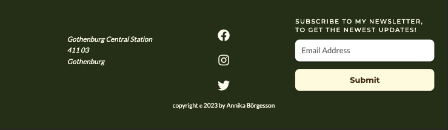
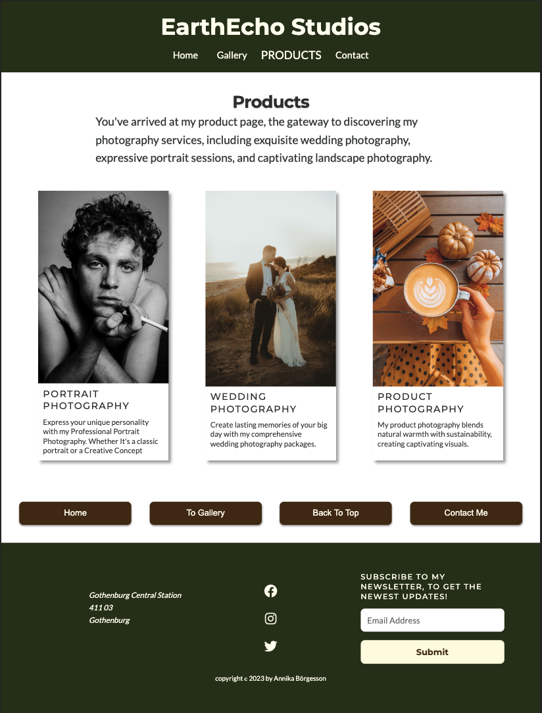

# EarthEcho Studios

# Introduction

Welcome to EarthEcho Studios! I'm thrilled to have you here and share a glimpse of Sophies world of visual storytelling through photography. Sophie is an amazing photographer specializing in weddings, portraits, product photograpy. This webpage is for anyone that want to catch a special moment or wanting tp get high-quality photos of their own products and stores.
This is a fictional company and a made up character for this educational project.
This README serves as your guide to navigate through the building of this website.

## Table of Content

- [**EarthEcho Studios**](#EarthEcho-Studios)
  - [**Table of Content**](#table-of-content)
  - [**Planning & development**](#planning--developmnet)
    - [**Project Goals**](#project-goals)
    - [**User-Centered Approach**](#user-centered-approach)
      - [**As a buisness Owner**](#as-a-buisness-owner)
      - [**As a General user/costumer**](#as-a-general-usercostumer)
      - [**As a New User**](#as-a-new-user)
    - [**Wireframes**](#wireframes)
      - [**Home Page**](#home-page)
      - [**Gallery Page**](#gallery-page)
      - [**Product Page**](#product-page)
      - [**Contact Page**](#contact-page)
    - [**Colors**](#colors)
    - [**Fonts**](#fonts) -[**Design Philosophy/ Features**](#design-philosophy-features)
  - [**Testing**](#testing) -[**Devtools**](#devtools)
    - [**Ligthouse**](#lighthouse)
      - [**Issues**](#issues)
      - [**Results**](#results)
  - [**Deployment**](#deployment)
  - [**Languages**](#languages)
  - [**Software**](#software)
  - [**Media**](#media) -[**Usage**](#usage) -[**Modification**](#modification) -[**Distribution**](#distrubition) -[**Private Use**](#private-use) -[**Liability**](#liability)
  - [**Credits**](#credits)
  - [**Special thanks**](#special-thanks) -[**What I've learned**](#what-ive-learned)

## Planning & developmnet

<!-- Needs edit-->

In the process of creating EarthEcho Studios, I followed a plan that revolved around Sophie's vision for her photography business. The development of the website had the following goals to aim for:

### Project Goals

1. **Online Presence**: To establish an online presence for Sophie's business EarthEcho Studio. This to reach a larger audince and a way for Sophie to show her work to the world.

2. **Costumer Base**: Making it easier for potential clients to find ans connect with Sophie and therfore growing her local costumer base.

3. **Booking Platform**: Making a way for costumers to cotact and book a photoshoot with Sophie, based on thir own preferenses.

4. **Costumer Interaction**: Offer a clear and accessible contact information for the costumers.

5. **Information Accessibility**: Make sure both new as well as existing costumers easily can access relevant informatino about EarthEcho Studios and the services Sophie have.

### User-Centered Approach

#### As a buisness Owner

Sophie, as the owner of EarthEcho Studios ans the website, she had the following objectives:

- To create an online presence to be able to promote her photography and her business.
- Expand the costumer base by showcasing her work online.
- Being able to provide a clear easly fond contact option for costumers for booking or asking questions.
- Have correct and easily understandable information for her costumers as well as for potential costumers.

#### As a General user/costumer

Users and potential costumers visiting EarthEcho Studios wanted to:

- Get to know the photographer Sophie, to be able to figure out if she's the right fit for them.
- Find contact information and being able to get in contact with Sophie.
- Being able to see a gallery/portpholio as well as informatino about the different kinds of photoshoots Sophie offers.

#### As a New User

New users landing on ErathEcho Studios website aimed to:

- Discover information about the photographer, Sophie.
- Learn about tje different products offered.
- View a gallery/portpholio of Sophies photoshoots.

### Wireframes

I created my wireframes for the website by using [Balsamiq](https://balsamiq.com/). I created one wireframe for mobile, tablet and desktop on each page of the website.

#### **Home page**

- [Wireframes for mobile](docs/wireframes/wireframe-mobile-home.png)
- [Wireframes for tablet](docs/wireframes/wireframe-tablet-home.png)
- [Wireframes for desktop](docs/wireframes/wireframe-desktop-home.png)

#### **Gallery page**

- [Wireframes for mobile](docs/wireframes/wireframe-gallery-mobile.png)
- [Wireframes for tablet](docs/wireframes/wireframe-gallery-tablet.png)
- [Wireframes for desktop](docs/wireframes/wireframe-desktop-gallery.png)

#### **Product page**

- [Wireframes for mobile](docs/wireframes/wireframe-product-mobile.png)
- [Wireframes for tablet](docs/wireframes/wireframe-tablet-product.png)
- [Wireframes for desktop](docs/wireframes/wireframe-desktop-product.png)

#### **Contact page**

- [Wireframes for mobile](docs/wireframes/wireframe-mobile-contact.png)
- [Wireframes for tablet](docs/wireframes/wireframe-tablet-contact.png)
- [Wireframes for desktop](docs/wireframes/wireframe-contact-desktop.png)

### Colors

- I used [Coolors](https://coolors.co/) for making a color palette for the website.

- 

I then used [Tint and Shades](https://maketintsandshades.com/#283618) to find different tints and shades of the colors from the original color palette.

- 
- 

I used [Color Contrast Shecker](https://coolors.co/contrast-checker/112a46-acc8e5) to make sure I used colors that had good contrast to eachother.

- 

- At first I used all the colors from the color palette, but once I made the color contrast checks, I choose to use some tints and shades from the original colors instead.
  - Two tints from the color #fefae0 I used where #fffdf0 and #fffef9.
  - Two shades I used from the color #bc6c25 where #96561e and #4b2b0f.

### Fonts

I used a font called Montserrat for headings and subheadings on the website, and for the text I used a font called Lato. I added Inter and Sans-serif as fallback fonts on the texts, and Sans-serif as a fallback for the headings and subheadings.

### Design Philosophy/ Features

The design of EarthEcho Studios website have been carefully thought out to create a user-friendly and an engaging expreience, Key design elements and principles include:

- **Header**: A responsive navigation bar, that adapts to different screens sizes, ensuring easy access to all pages. The navbar collapse into a dropdown menu, when a certain sreen size is used, and the navbar is then reached by the classic burger icon.

![Header Mobile]

- **Navigation Buttons**: A responsive section of links to all pages of the website. As it is localised just above the footer, it also have a button "Back to top" so users don't have to scroll to the top of each page.

- **Footer**: A responsive footer that contains an address to the business, social media links, a newsletter sign-up option and copyright details.

- **Hero**: A visually appealing introduction featuring a picture of Sophie and brief overwies of the websites content and a brief introduction of Sophie.

- **Gallery Section**: This section is dedicated to showcasing a glimpse of Sophies photographies.

- **Gallery Page**: A presentation to the gallery section and high-quality images from former photoshoots, to give a deepdive into Sophies photography style, with a focus on image presentation and responsiveness.

- **Product Page**: A detailed description of the different kinds of photography Sophie does, and a high-quality image to each category.

- **Contact Page**: A user-friendly contact form and a textbox with a minimal but jet intresting layout to capture the users attention.

### Future Features

Future features for the webpage are:

- Smooth scrolling, to improve user experience.
- Catagoritation of the gallery into different photography catagories.
- A carousel of reviews from former costumers, to build trust.
- Expansion of the contact form witg optiions for different types of photoshoots.
- Being able to buy order and pay some of the photoshoots right away.

## Testing

- Throughout the whole development of the webpage, I've made tests in:

### DevTools

- Troughout the development I've used Devtools to inspect and test the website to be able to make the best I could for it.

### Lighthouse

#### Issues

- I've used Lighthouse to test the website where I got the error about the color on the navbar text. The colors made it through the Contrast Color checker, but in Lighthouse it was ruled as an issue.

- Another error I got was the image size for the Home page and the Galley page, so I tried to make them even smaller, without loosing the quality of the images. In the next section are the results of the resizing and further opimization.

#### Results

- One of the hardest part of building this website where the images. It took a lot of effort and many redos before I got this result. Not all of them are 100% becasue of the amount of images on some of the pages, but I came to the conclution that if I would change the images even further, they would loose their quality, and therfore are the results between 96-100% in performance.

- W3c hmtl validator: I've used a extention clled Prettier in VS Code while developing, and this is why the website have these informations in the test.

- [HTML Validator Test Home Page Part 1](docs/testing/w3c-index-test-1.png)
- [HTML Validator Test Home Page Part 2](docs/testing/w3c-index-test-2.png)
- 

- [HTML Validator Test Gallery Page Part 1](docs/testing/w3c-gallery-test-1.png)
- [HTML Validator Test Gallery Page Part 2](docs/testing/w3c-gallery-test-2.png)
- [HTML Validator Test Gallery Page Part 3](docs/testing/w3c-gallery-test-3.png)
- 

- [HTML Validator Test Product Page Part 1](docs/testing/w3c-products-test-1.png)
- [HTML Validator Test Product Page Part 2](docs/testing/w3c-products-test-2.png)
- 

- [HTML Validator Test Contact Page Part 1](docs/testing/w3c-contact-test-1.png)
- [HTML Validator Test Contact Page Part 2](docs/testing/w3c-contact-test-2.png)
- 

- W3c css validator for CSS code , Jigsaw

### Manual testing

- I've tested the website in Safari, Brave and Google Chrome without running in to any issues.
- I've tested the website from an Iphone safari as well.

## Deployment

I deployed early to ba able to test the website deployed during the development. Following step are a description of how to deploy a webpage on GitHub:

1. Open the [repository](https://github.com/Annibor/EarthEcho-Studios) and find the Settings tab.
2. The navigate to the tab called Pages on the left.
3. Choose to Deploy from a branch. For me it was the main branch.
4. Save it. It can take a few minutes, but then you will be able to find the link to the deployed website in the repository on the menu to the right, under [Deplyments](https://github.com/Annibor/EarthEcho-Studios/deployments).
5. There you'll find the daployes website no top of the page under the heading Active deployments.

My link is: [EartEcho Studios](https://annibor.github.io/EarthEcho-Studios/)

## Languages

- This website was bulit using HTML and CSS.

## Software

- I've used Visual Studio Code to write the code.
- I've used Git to load and push my code to Github and for version control.
- I've used GitHub for repository management.
- I've used Squoosh.app to compromize all images.
- I've used preinstalled app called "Prevew" to edit the sizes of the photos.
- I've used Coolors.co to find a color palette for the website.
- I've also used Coolors.co to contrast check text colors and background colors.
- I've used maketintsandshades.com to find evetuals tints and shadow colors as a complement for the color palette.
- I've used Balsamiq when I made the wireframes for the website.
- I've used Chat GPT and google translate for some translations and questions.

## Media

- All images are taken from unsplash.com
- Icons are taken from fontawsome.com
- Favicons are from favicon.io

## Usage

- This project is available for viewing and may be used for educational purposes.

## Modification

- Modification, including altering, transforming or extending of this project is not permitted fon any commercial or public purposes without explicit permission.

## Distrubition

- The redistribution of this project, wheter in its original form or with modifications, is sricktly prohibited without prior consent.

## Private Use

- Feel free to use this project for private purposes, sush as personal reference or study.

## Liability

- The creator of this project shall not be held liable for any adverse outcomes or damages resulting from the use or misapplication of this project. Users are advised to exercise due care and discretion when utilizing the project's resources and functionalities.

## Credits

### Content

- The EarthEcho Studios website draws inspiratind fron Jonas Schmedtmann's Omnifood Project, available at [GitHub](https://github.com/jonasschmedtmann/html-css-course/tree/master/final).

- The header and navbar design were influenced by the Omnifood Project and Love Running Project available at [Github](https://github.com/Code-Institute-Solutions/love-running-v3/tree/main).

- The layout for the gallery page is inspired by the exceptional work of George W. Park, available at [CodePen](https://codepen.io/GeorgePark/pen/vdqYom). I made costumizations for the layout. For example adjusting the box-shadow, the gap, and choosen specific images for this website. I opted to use the flex-box code from the original design. I choose to do like this because it was the best design for the specific page of the website.

- The layout for images and the text to each image on the Product page are inspired by the work of George W. Park, available at [CodePen](https://codepen.io/GeorgePark/pen/vdqYom). I made the privious mentioned costumizations for the layout on this page, but also including the text boxexsunder each images. The box-shadow then lays under the image and the text-box like it is one component. I opted to use the flex-box code from the original design.

  - The grid box used in the product page are inspired by Jonas Schmedtmann's Omnifood Project, available at [GitHub](https://github.com/jonasschmedtmann/html-css-course/tree/master/final).

- This README is based on a README created by Davis Calikes, available at [GitHub](https://github.com/davidcalikes/portfolio-project-one#readme).

### Special Thanks

- **Michel**: A heartfelt thank you to my amazing boyfriend for unwavering support throughout the wholr project.

- **Pierre: Code Institute Student**:Pierre have been an invauable collaborator, offering discussions on project-related topics as well as discussions about code in general.

- **Gemma & Roman: Code Institute Tutor support**: A big thank you to Gemma and Roman for giving me help and guidance during the development.

- **David: Code Institute**: To David who quickly answerd any questions I had about the project, so I could keep developing and finish this project.

## What I've learned

- While developing this website I've learned a lot of things, not only the developing process but also about myself.
- One big thing I've learned the hard way is to do the documentation in README throughout the developing. I only did a breif structure with basic information at the benning.
  -I've learned the basics of using flex-grid and flex-box, which have been really fun to work with.
- I've learned how to debug and test the code that I'm working on.
- I've learned that it's okey to make misstakes, because that's when you learn the most.
- I didn't know how to use Git or GitHub before starting this project, but now I feel that I know the basics of how to use them.
- Another thing is that testing the code, debugging and doing research takes most of the time of the whole process.
- On a personal level I've learned the learning process takes time, and by doing the same thing over and over for prectice and being curious is the best way to learn.
